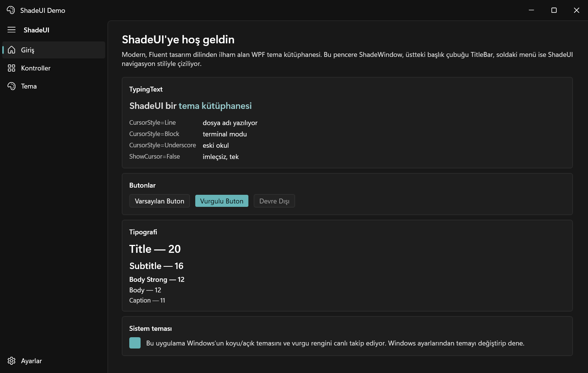

# ShadeUI

A modern, Fluent-inspired UI and theme library for WPF — custom window chrome, dark/light themes that follow Windows live, and cleanly styled controls.




## Features

- 🪟 **ShadeWindow** — custom window chrome with a Win11-style title bar, dark-mode aware non-client area, a themed 1 px DWM border, rounded corners and open/close transitions
- 🎛️ **Declarative TitleBar** — `TitleAlignment`, `IconGlyph` / `ShowIcon`, leading & trailing content slots, `CanMaximize`, `CloseButtonAction`, plus the native behaviours custom chrome usually loses: **Snap Layouts** on the maximize button and the **system menu** on right-click
- 🎨 **Live system theming** — follows the Windows dark/light setting *and* accent color in real time (`Theme="System"`)
- 🌗 **Dark & Light palettes** — WinUI-style design tokens (`ApplicationBackgroundBrush`, `TextFillColorPrimaryBrush`, `AccentFillColorDefaultBrush`, …) on one even surface ramp: shell → content pane → card → control
- 🧩 **Styled controls** — buttons (default + accent), `TextBox` with placeholder / icon / clear button, navigation list, cards, modern scrollbars
- ✨ **Reveal highlight** — `effects:Reveal.IsEnabled` makes a control light up from the pointer position, plus animated press/spring-back and an accent glow; the reveal colors are palette tokens, so it works on both dark and light surfaces
- 📐 **Compact by design** — a single set of sizing tokens (`ControlHeight`, `ControlPadding`, `ControlCornerRadius`, …) drives every control; 24 px control height, 12 px body text
- 📦 **Drop-in setup** — two resource dictionaries in `App.xaml` and you are done

## Getting started

> NuGet package coming soon. For now, clone and reference `src/ShadeUI/ShadeUI.csproj`.

**1. Merge the theme in `App.xaml`:**

```xml
<Application
    xmlns:ui="http://schemas.shadeui.dev/2026/xaml">
    <Application.Resources>
        <ResourceDictionary>
            <ResourceDictionary.MergedDictionaries>
                <ui:ThemesDictionary Theme="System" />
                <ui:ControlsDictionary />
            </ResourceDictionary.MergedDictionaries>
        </ResourceDictionary>
    </Application.Resources>
</Application>
```

`Theme` can be `System`, `Dark` or `Light`.

**2. Use `ShadeWindow` with a `TitleBar`:**

```xml
<ui:ShadeWindow
    x:Class="MyApp.MainWindow"
    xmlns:ui="http://schemas.shadeui.dev/2026/xaml"
    Title="My App">
    <Grid>
        <Grid.RowDefinitions>
            <RowDefinition Height="Auto" />
            <RowDefinition Height="*" />
        </Grid.RowDefinitions>

        <ui:TitleBar Grid.Row="0" Title="My App" />

        <!-- your content -->
    </Grid>
</ui:ShadeWindow>
```

`TitleBar` is configured entirely from XAML:

```xml
<ui:TitleBar
    Title="My App"
    TitleAlignment="Center"          
    IconGlyph="&#xE790;"             
    ShowIcon="True"
    TitleFontWeight="SemiBold"
    CanMaximize="False"              
    CloseButtonAction="Hide"         
    IsSnapLayoutEnabled="True"       
    IsSystemMenuEnabled="True">      
    <ui:TitleBar.TrailingContent>
        <Button Content="Theme" />
    </ui:TitleBar.TrailingContent>
</ui:TitleBar>
```

| Property | What it does |
|---|---|
| `TitleAlignment` | `Left` / `Center` / `Right`. `Center` centres the title on the window, independent of the icon and caption buttons |
| `IconGlyph`, `ShowIcon` | Use a Segoe Fluent glyph instead of an `Icon` image, or hide the icon entirely |
| `TitleFontSize`, `TitleFontWeight`, `TitleForeground` | Restyle the title without retemplating |
| `LeadingContent`, `TrailingContent` | Free content slots after the icon and before the caption buttons |
| `CanMaximize` | Disables the maximize button, Snap Layouts *and* double-click-to-maximize |
| `CloseButtonAction` | `Close` or `Hide` — for apps that live in the tray |
| `IsSnapLayoutEnabled` | Hovering the maximize button opens the Windows 11 Snap Layouts flyout |
| `IsSystemMenuEnabled` | Right-clicking the bar opens the window's Move / Size / Close menu |

**3. Switch themes at runtime:**

```csharp
using ShadeUI.Appearance;

ThemeManager.Apply(ApplicationTheme.Dark);    // force dark
ThemeManager.Apply(ApplicationTheme.System);  // follow Windows again
```

## NavigationView

```xml
<ui:NavigationView PaneTitle="My App" SelectionChanged="OnNavSelectionChanged">
    <ui:NavigationView.MenuItems>
        <ui:NavigationViewItem Icon="&#xE80F;" Content="Home" Tag="0" />
        <ui:NavigationViewItem Icon="&#xE8A9;" Content="Controls" InfoBadge="6" Tag="1" />
    </ui:NavigationView.MenuItems>
    <ui:NavigationView.FooterItems>
        <ui:NavigationViewItem Icon="&#xE713;" Content="Settings" Tag="2" />
    </ui:NavigationView.FooterItems>
</ui:NavigationView>
```

`MenuItems` sit at the top, `FooterItems` are pinned to the bottom. The pane animates
between `OpenPaneLength` (190) and `CompactPaneLength` (44) via `IsPaneOpen` or the
built-in toggle button; collapsed, items show only their glyph. Also supports
`Header`, `IsBackButtonVisible` + `BackRequested`, and `SelectedItem` /
`SelectionChanged`. Page changes animate through the built-in `TransitionPresenter`.

## TypingText

A text element that types itself out, optionally cycling through a list of words.

```xml
<ui:TypingText Loop="True" TypeSpeed="65" DeleteSpeed="35" PauseDelay="1400"
               TextStyle="Subtitle" CursorStyle="Line">
    <ui:TypingText.Words>
        <sys:String>a theme library</sys:String>
        <sys:String>a control set</sys:String>
    </ui:TypingText.Words>
</ui:TypingText>

<!-- or a single string -->
<ui:TypingText Text="hello world" Duration="70" Delay="400" ShowCursor="False" />
```

| Property | Type | Default | Description |
|---|---|---|---|
| `Text` | string | `""` | Single string to animate |
| `Words` | collection | empty | Strings to type and delete in sequence; takes precedence over `Text` |
| `Duration` | double | 100 | Milliseconds per character when typing `Text` |
| `TypeSpeed` | double | 100 | Milliseconds per character when typing a `Words` entry |
| `DeleteSpeed` | double | 50 | Milliseconds per character while deleting |
| `Delay` | double | 0 | Milliseconds before the first character |
| `PauseDelay` | double | 1000 | Milliseconds to hold a finished word |
| `Loop` | bool | false | Restart after the last entry |
| `TextStyle` | enum | `Body` | Type-ramp level: `Caption`…`Display` |
| `StartOnView` | bool | true | Wait until scrolled into view |
| `ShowCursor` | bool | true | Draw the caret |
| `BlinkCursor` | bool | true | Blink the caret (VS Code cadence, 530 ms) |
| `CursorStyle` | enum | `Line` | `Line`, `Block` or `Underscore` |
| `CursorBrush` | Brush | `null` | Caret colour; falls back to `Foreground` |

Also exposes `DisplayText` (read-only), `IsRunning`, `Start()`, `Stop()` and a `Completed` event.

Two props from the web original have no WPF counterpart: `className` (use `Style`) and
`as` — WPF cannot swap its element type, so the semantic level is expressed through
`TextStyle` instead.

## Demo

The repository ships a live gallery app:

```
dotnet run --project samples/ShadeUI.Demo
```

## Roadmap

- [x] ShadeWindow + TitleBar (custom chrome)
- [x] Dark/Light palettes with live system + accent tracking
- [x] Button, navigation, card, scrollbar styles
- [x] Compact sizing token system
- [x] Reveal / press animations on buttons
- [x] TextBox (placeholder, icon, clear button, multiline)
- [x] CheckBox (three-state) + RadioButton
- [x] Deep dark surface ramp, window border, open/close + page transitions
- [x] TitleBar properties + Snap Layouts + system menu
- [x] ToggleSwitch (`OnContent` / `OffContent`) — CSS-derived sliding/rotating knob
- [x] CheckBox path-morph animation (`StrokeDash` attached property)
- [x] TypingText (typewriter animation with word cycling)
- [x] ComboBox (flyout dropdown, editable mode)
- [x] NavigationView + NavigationViewItem (collapsible rail, footer items, info badges)
- [ ] NuGet package

## License

[MIT](LICENSE) © shadesofdeath
